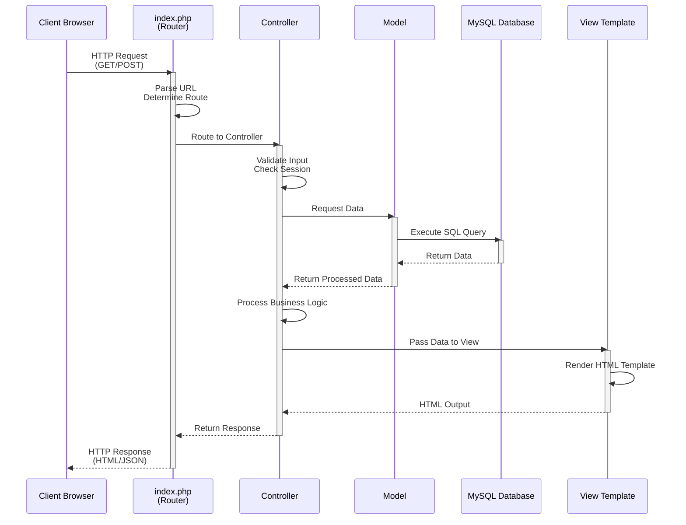
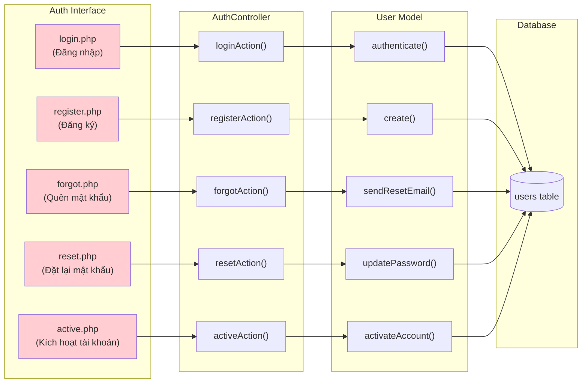
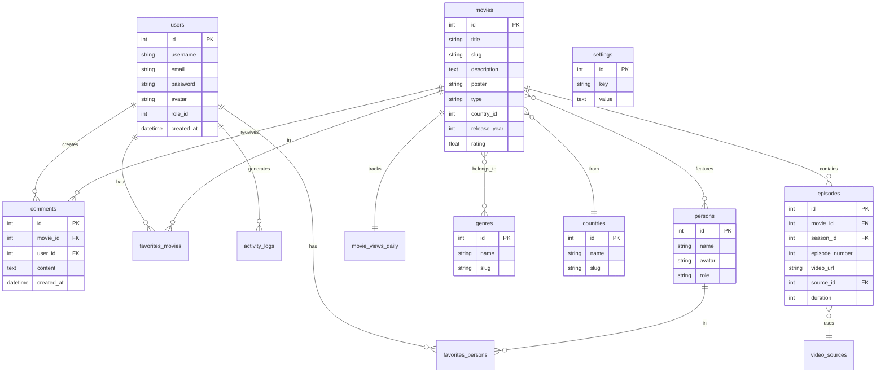
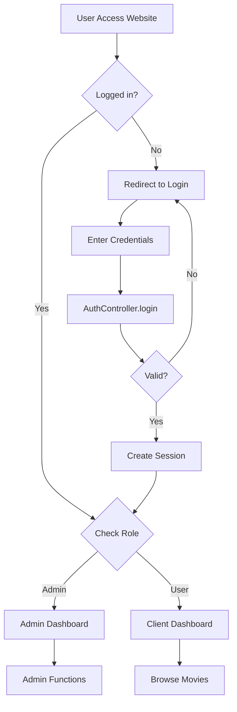
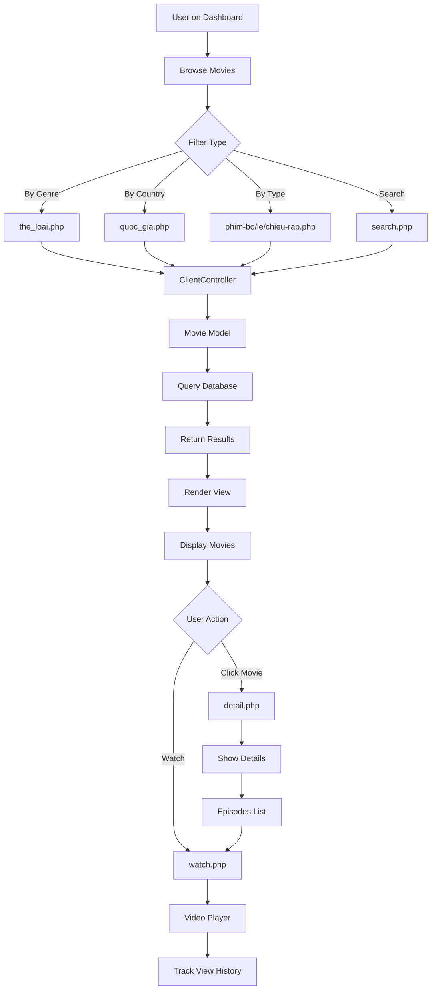
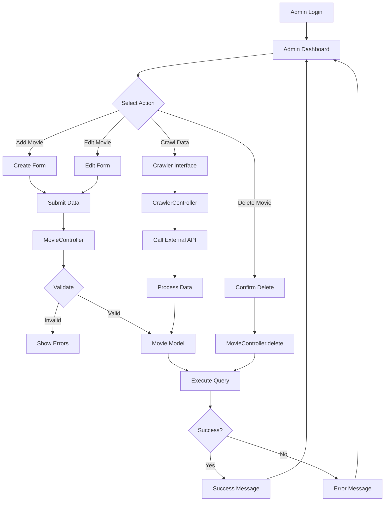
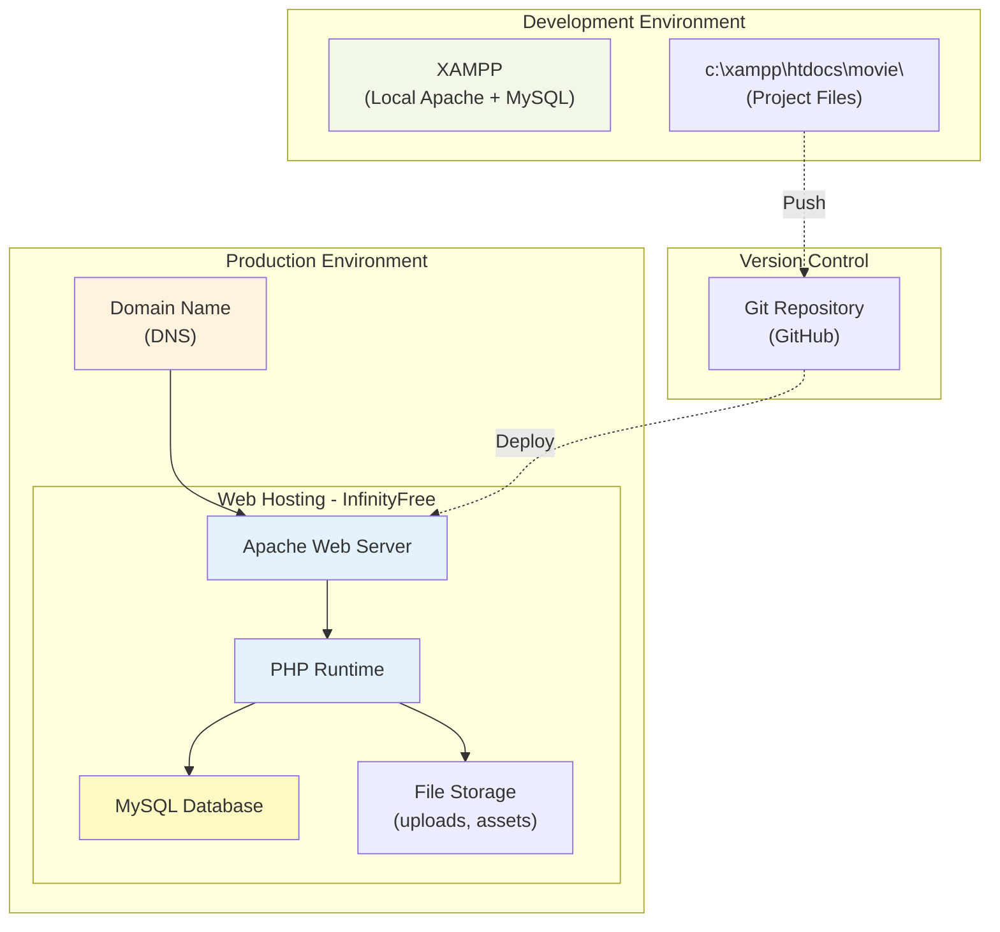
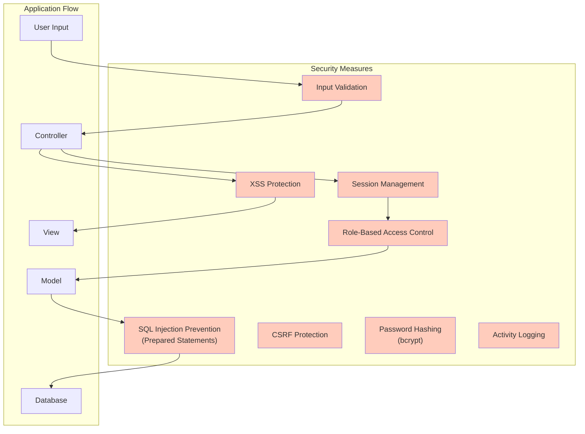

# Sơ Đồ Kiến Trúc Hệ Thống - Movie Website

## Tổng Quan Kiến Trúc

Hệ thống được xây dựng theo mô hình **MVC (Model-View-Controller)** với PHP, tích hợp MySQL database và hỗ trợ 3 giao diện chính:
- **Auth**: Xác thực người dùng
- **Admin**: Quản trị hệ thống  
- **Client**: Giao diện người dùng cuối

---

## Sơ Đồ Kiến Trúc Tổng Thể

```mermaid
graph TB
    subgraph "CLIENT LAYER - Browser"
        A1["Web Browser"]
        A2["HTML/CSS/JavaScript"]
        A3["AJAX Requests"]
    end
    
    subgraph "WEB SERVER LAYER - Apache/PHP"
        subgraph "Entry Points"
            B1["index.php<br/>(Router)"]
        end
        
        subgraph "MVC Architecture"
            C1["Controllers Layer"]
            C2["Models Layer"]
            C3["Views Layer"]
        end
        
        subgraph "Controllers - 22 Controllers"
            D1["AuthController<br/>(Login, Register, Reset)"]
            D2["AdminController<br/>(Dashboard, Management)"]
            D3["ClientController<br/>(Movie Browsing)"]
            D4["AccountController<br/>(User Profile)"]
            D5["MovieController"]
            D6["CommentController"]
            D7["..."[Other Controllers]]
        end
        
        subgraph "Models - 15 Models"
            E1["User Model"]
            E2["Movie Model"]
            E3["Episode Model"]
            E4["Comment Model"]
            E5["Genre Model"]
            E6["Country Model"]
            E7["Person Model"]
            E8["Setting Model"]
            E9["..."[Other Models]]
        end
        
        subgraph "Views - 3 Main Layouts"
            F1["Auth Views<br/>(Login, Register,<br/>Forgot, Reset, Active)"]
            F2["Admin Views<br/>(Dashboard, Movies,<br/>Users, Settings, Logs)"]
            F3["Client Views<br/>(Dashboard, Detail,<br/>Watch, Search, Profile)"]
        end
        
        B1 --> C1
        C1 --> D1
        C1 --> D2
        C1 --> D3
        C1 --> D4
        C1 --> D5
        C1 --> D6
        C1 --> D7
        
        D1 --> E1
        D2 --> E2
        D2 --> E5
        D2 --> E6
        D3 --> E2
        D3 --> E3
        D4 --> E1
        D5 --> E2
        D5 --> E3
        D6 --> E4
        D7 --> E9
        
        E1 --> C2
        E2 --> C2
        E3 --> C2
        E4 --> C2
        E5 --> C2
        E6 --> C2
        E7 --> C2
        E8 --> C2
        E9 --> C2
        
        D1 --> F1
        D2 --> F2
        D3 --> F3
        D4 --> F3
        
        F1 --> C3
        F2 --> C3
        F3 --> C3
    end
    
    subgraph "DATABASE LAYER - MySQL"
        G1[("MySQL Database")]
        
        subgraph "Database Tables"
            H1["users<br/>(Authentication & Profile)"]
            H2["movies<br/>(Movie Information)"]
            H3["episodes<br/>(Episode Data)"]
            H4["comments<br/>(User Comments)"]
            H5["genres<br/>(Categories)"]
            H6["countries<br/>(Countries)"]
            H7["persons<br/>(Actors, Directors)"]
            H8["settings<br/>(System Configuration)"]
            H9["activity_logs<br/>(User Activity)"]
            H10["favorites_movies<br/>(User Favorites)"]
            H11["favorites_persons<br/>(Favorite Actors)"]
            H12["movie_views_daily<br/>(View Statistics)"]
            H13["video_sources<br/>(Source Names)"]
            H14["..."[Other Tables]]
        end
        
        G1 --- H1
        G1 --- H2
        G1 --- H3
        G1 --- H4
        G1 --- H5
        G1 --- H6
        G1 --- H7
        G1 --- H8
        G1 --- H9
        G1 --- H10
        G1 --- H11
        G1 --- H12
        G1 --- H13
        G1 --- H14
    end
    
    subgraph "EXTERNAL SERVICES"
        I1["Third-party Movie API<br/>(Data Crawling)"]
    end
    
    A1 --> A2
    A2 --> A3
    A3 -->|HTTP Request| B1
    
    C2 -->|SQL Queries| G1
    G1 -->|Data Results| C2
    
    D7 -->|Crawler| I1
    I1 -->|Movie Data| D7
    
    C3 -->|HTML Response| A3
    
    style A1 fill:#e1f5ff
    style B1 fill:#fff3e0
    style C1 fill:#f3e5f5
    style C2 fill:#e8f5e9
    style C3 fill:#fce4ec
    style G1 fill:#fff9c4
```

---

## Sơ Đồ Luồng Xử Lý Request



---

## Chi Tiết 3 Giao Diện Chính

### 1. Auth Layout (Xác Thực)



**Chức năng:**
- Đăng nhập/Đăng xuất
- Đăng ký tài khoản mới
- Quên mật khẩu & reset
- Kích hoạt tài khoản

---

### 2. Admin Layout (Quản Trị)

```mermaid
graph TB
    subgraph "Admin Interface"
        A1["dashboard.php<br/>(Tổng quan)"]
        A2["movies/<br/>(Quản lý phim)"]
        A3["user/<br/>(Quản lý user)"]
        A4["genres/<br/>(Thể loại)"]
        A5["country/<br/>(Quốc gia)"]
        A6["person/<br/>(Diễn viên/Đạo diễn)"]
        A7["setting/<br/>(Cấu hình)"]
        A8["logs/<br/>(Activity logs)"]
        A9["comments/<br/>(Quản lý comment)"]
        A10["crawler/<br/>(Crawl dữ liệu)"]
        A11["support/<br/>(Hỗ trợ)"]
    end
    
    subgraph "Admin Controllers"
        B1["AdminController"]
        B2["MovieController"]
        B3["UserController"]
        B4["GenreController"]
        B5["CountryController"]
        B6["PersonController"]
        B7["SettingController"]
        B8["CommentController"]
        B9["CrawlerController"]
    end
    
    A1 --> B1
    A2 --> B2
    A3 --> B3
    A4 --> B4
    A5 --> B5
    A6 --> B6
    A7 --> B7
    A8 --> B1
    A9 --> B8
    A10 --> B9
    A11 --> B1
    
    style A1 fill:#c5cae9
    style A2 fill:#c5cae9
    style A3 fill:#c5cae9
    style A4 fill:#c5cae9
    style A5 fill:#c5cae9
    style A6 fill:#c5cae9
    style A7 fill:#c5cae9
    style A8 fill:#c5cae9
    style A9 fill:#c5cae9
    style A10 fill:#c5cae9
    style A11 fill:#c5cae9
```



**Chức năng:**
- Dashboard với thống kê
- CRUD Movies, Episodes, Seasons
- Quản lý Users, Roles
- Quản lý Genres, Countries, Persons
- Cấu hình hệ thống (Settings)
- Xem Activity Logs
- Quản lý Comments
- Crawler phim từ API
- Hỗ trợ người dùng

---

### 3. Client Layout (Người Dùng)

```mermaid
graph TB
    subgraph "Client Interface"
        C1["dashboard.php<br/>(Trang chủ)"]
        C2["detail.php<br/>(Chi tiết phim)"]
        C3["watch.php<br/>(Xem phim)"]
        C4["phim-bo.php<br/>(Phim bộ)"]
        C5["phim-le.php<br/>(Phim lẻ)"]
        C6["phim-chieu-rap.php<br/>(Phim chiếu rạp)"]
        C7["the_loai.php<br/>(Thể loại)"]
        C8["quoc_gia.php<br/>(Quốc gia)"]
        C9["dien_vien.php<br/>(Diễn viên)"]
        C10["persons.php<br/>(Danh sách diễn viên)"]
        C11["search.php<br/>(Tìm kiếm)"]
        C12["user/<br/>(Hồ sơ cá nhân)"]
        C13["comment.php<br/>(Bình luận)"]
        C14["filter.php<br/>(Lọc phim)"]
    end
    
    subgraph "Client Controllers"
        D1["ClientController"]
        D2["MovieController"]
        D3["AccountController"]
        D4["CommentController"]
    end
    
    C1 --> D1
    C2 --> D2
    C3 --> D2
    C4 --> D1
    C5 --> D1
    C6 --> D1
    C7 --> D1
    C8 --> D1
    C9 --> D1
    C10 --> D1
    C11 --> D1
    C12 --> D3
    C13 --> D4
    C14 --> D1
    
    style C1 fill:#b2dfdb
    style C2 fill:#b2dfdb
    style C3 fill:#b2dfdb
    style C4 fill:#b2dfdb
    style C5 fill:#b2dfdb
    style C6 fill:#b2dfdb
    style C7 fill:#b2dfdb
    style C8 fill:#b2dfdb
    style C9 fill:#b2dfdb
    style C10 fill:#b2dfdb
    style C11 fill:#b2dfdb
    style C12 fill:#b2dfdb
    style C13 fill:#b2dfdb
    style C14 fill:#b2dfdb
```



**Chức năng:**
- Trang chủ với phim trending
- Xem chi tiết phim
- Xem phim (video player)
- Danh sách phim theo loại
- Tìm kiếm và lọc phim
- Quản lý profile cá nhân
- Danh sách yêu thích
- Continue watching
- Bình luận phim
- Xem diễn viên

---

## Kiến Trúc Database



---

## Công Nghệ Sử Dụng

### Backend
- **Language**: PHP 8.x
- **Architecture**: MVC Pattern
- **Database**: MySQL 8.x
- **Web Server**: Apache (XAMPP)

### Frontend
- **HTML5**: Cấu trúc trang
- **CSS3**: Styling (với responsive design)
- **JavaScript**: Client-side logic
- **AJAX**: Asynchronous requests
- **Swiper.js**: Carousel/Slider
- **Video.js**: Video player

### External Integration
- **Third-party Movie API**: Crawl dữ liệu phim
- **Email Service**: Gửi email reset password

---

## Luồng Hoạt Động Chính

### 1. User Authentication Flow



### 2. Movie Browsing Flow



### 3. Admin CRUD Flow



---

## Deployment Architecture



---

## Security Layers



---

## Tổng Kết

Hệ thống Movie Website được xây dựng với:

✅ **Kiến trúc MVC** rõ ràng, tách biệt logic - data - presentation

✅ **3 giao diện độc lập**: Auth, Admin, Client với mục đích riêng biệt

✅ **Database chuẩn hóa** với quan hệ rõ ràng giữa các bảng

✅ **Security layers** đầy đủ để bảo vệ dữ liệu và người dùng

✅ **Scalable architecture** dễ dàng mở rộng và bảo trì

✅ **RESTful practices** trong xử lý HTTP requests

✅ **External API integration** cho việc crawl dữ liệu phim
