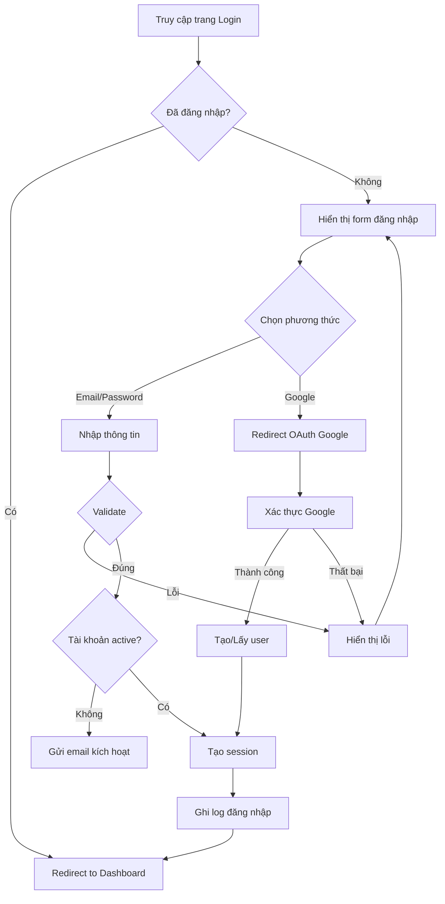
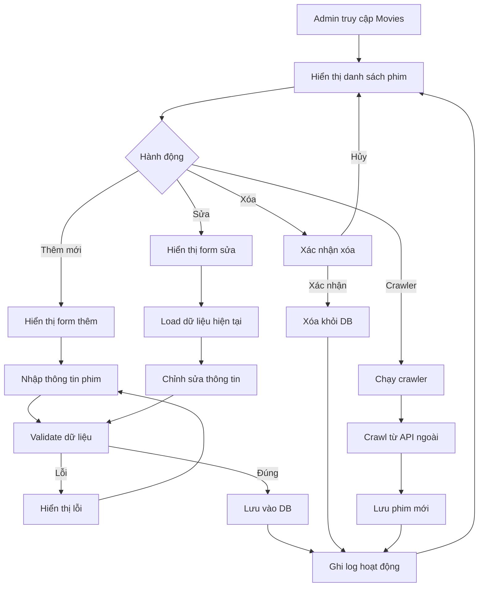

# Sơ Đồ Use Case - Hệ Thống Website Phim "Phê Phim"

## Tổng Quan Hệ Thống

Dựa trên phân tích cấu trúc các file trong:
- `app/Views/layout/clients` - Giao diện người dùng
- `app/Views/layout-part/admin` - Giao diện quản trị
- `app/Views/layout-part/auth` - Giao diện xác thực

---

## Các Actor (Tác Nhân)

| Actor | Mô Tả |
|-------|-------|
| 👤 **Guest** (Khách) | Người dùng chưa đăng nhập, chỉ có thể xem phim và đăng ký/đăng nhập |
| 👥 **User** (Thành viên) | Người dùng đã đăng nhập, có thể bình luận, yêu thích, gửi hỗ trợ |
| 🔧 **Admin** (Quản trị viên) | Quản lý toàn bộ hệ thống |

---

## Sơ Đồ Use Case

```mermaid
flowchart TB
    subgraph Actors["👥 Actors"]
        Guest["👤 Guest<br/>(Khách)"]
        User["👥 User<br/>(Thành viên)"]
        Admin["🔧 Admin<br/>(Quản trị viên)"]
    end

    subgraph Auth["🔐 XÁC THỰC (Authentication)"]
        UC_Login["Đăng nhập"]
        UC_Register["Đăng ký"]
        UC_GoogleLogin["Đăng nhập Google"]
        UC_Forgot["Quên mật khẩu"]
        UC_Reset["Đặt lại mật khẩu"]
        UC_Active["Kích hoạt tài khoản"]
        UC_Logout["Đăng xuất"]
    end

    subgraph Client["🎬 CHỨC NĂNG CLIENT"]
        UC_ViewDashboard["Xem Dashboard"]
        UC_ViewMovie["Xem chi tiết phim"]
        UC_WatchMovie["Xem phim"]
        UC_Comment["Bình luận"]
        UC_Favorite["Yêu thích phim"]
        UC_Support["Gửi yêu cầu hỗ trợ"]
        UC_Profile["Quản lý hồ sơ"]
    end

    subgraph AdminPanel["⚙️ QUẢN TRỊ HỆ THỐNG"]
        direction TB
        
        subgraph ContentMgmt["📽️ Quản lý Nội dung"]
            UC_ManageMovies["Quản lý Phim"]
            UC_ManageEpisodes["Quản lý Tập phim"]
            UC_ManageSeasons["Quản lý Mùa phim"]
            UC_ManageGenres["Quản lý Thể loại"]
            UC_ManageCountries["Quản lý Quốc gia"]
            UC_ManagePersons["Quản lý Diễn viên/Đạo diễn"]
            UC_ManageSources["Quản lý Nguồn video"]
        end
        
        subgraph UserMgmt["👥 Quản lý Người dùng"]
            UC_ManageUsers["Quản lý Users"]
            UC_ManageRoles["Quản lý Vai trò"]
            UC_ManageComments["Quản lý Bình luận"]
        end
        
        subgraph SupportMgmt["📨 Quản lý Hỗ trợ"]
            UC_ManageSupport["Quản lý Hỗ trợ"]
            UC_ManageSupportTypes["Quản lý Loại hỗ trợ"]
            UC_ReplySupport["Trả lời hỗ trợ"]
        end
        
        subgraph SystemMgmt["🖥️ Quản lý Hệ thống"]
            UC_Crawler["Crawler phim"]
            UC_Settings["Cài đặt chung"]
            UC_ViewLogs["Xem nhật ký"]
            UC_ViewDashboardAdmin["Dashboard Admin"]
        end
    end

    Guest --> UC_Login
    Guest --> UC_Register
    Guest --> UC_GoogleLogin
    Guest --> UC_Forgot
    Guest --> UC_Reset
    Guest --> UC_Active
    Guest --> UC_ViewDashboard
    Guest --> UC_ViewMovie
    Guest --> UC_WatchMovie

    User --> UC_Logout
    User --> UC_Comment
    User --> UC_Favorite
    User --> UC_Support
    User --> UC_Profile
    User --> UC_ViewDashboard
    User --> UC_ViewMovie
    User --> UC_WatchMovie

    Admin --> ContentMgmt
    Admin --> UserMgmt
    Admin --> SupportMgmt
    Admin --> SystemMgmt
```

---

## Chi Tiết Use Case Theo Module

### 🔐 Module Xác Thực (Auth)

> Dựa trên: [login.php](file:///c:/xampp/htdocs/movie/app/Views/layout-part/auth/login.php), [register.php](file:///c:/xampp/htdocs/movie/app/Views/layout-part/auth/register.php), [forgot.php](file:///c:/xampp/htdocs/movie/app/Views/layout-part/auth/forgot.php), [reset.php](file:///c:/xampp/htdocs/movie/app/Views/layout-part/auth/reset.php), [active.php](file:///c:/xampp/htdocs/movie/app/Views/layout-part/auth/active.php)

| Use Case | Actor | Mô Tả | Tiền điều kiện | Hậu điều kiện |
|----------|-------|-------|----------------|---------------|
| **UC-A01: Đăng nhập** | Guest | Đăng nhập bằng email/password | Chưa đăng nhập | Chuyển thành User |
| **UC-A02: Đăng nhập Google** | Guest | Đăng nhập bằng OAuth Google | Chưa đăng nhập | Chuyển thành User |
| **UC-A03: Đăng ký** | Guest | Tạo tài khoản mới (fullname, email, password) | Chưa có tài khoản | Email xác thực được gửi |
| **UC-A04: Kích hoạt tài khoản** | Guest | Xác nhận email kích hoạt | Đã đăng ký | Tài khoản được kích hoạt |
| **UC-A05: Quên mật khẩu** | Guest | Yêu cầu reset mật khẩu | Có tài khoản | Email reset được gửi |
| **UC-A06: Đặt lại mật khẩu** | Guest | Nhập mật khẩu mới | Có link reset hợp lệ | Mật khẩu được đổi |
| **UC-A07: Đăng xuất** | User | Kết thúc phiên đăng nhập | Đã đăng nhập | Chuyển thành Guest |

---

### 🎬 Module Client (Người dùng)

> Dựa trên: [dashboard.php (clients)](file:///c:/xampp/htdocs/movie/app/Views/layout/clients/dashboard.php)

| Use Case | Actor | Mô Tả |
|----------|-------|-------|
| **UC-C01: Xem Dashboard** | Guest, User | Xem trang chủ với danh sách phim nổi bật |
| **UC-C02: Xem chi tiết phim** | Guest, User | Xem thông tin chi tiết một bộ phim |
| **UC-C03: Xem phim** | Guest, User | Xem video tập phim |
| **UC-C04: Bình luận** | User | Thêm, sửa, xóa bình luận |
| **UC-C05: Yêu thích** | User | Thêm/xóa phim khỏi danh sách yêu thích |
| **UC-C06: Gửi hỗ trợ** | User | Gửi yêu cầu hỗ trợ đến admin |
| **UC-C07: Quản lý hồ sơ** | User | Cập nhật thông tin cá nhân, avatar |

---

### ⚙️ Module Admin (Quản trị)

> Dựa trên: [dashboard.php (admin)](file:///c:/xampp/htdocs/movie/app/Views/layout-part/admin/dashboard.php) và các thư mục con

#### 📽️ Quản lý Nội dung

| Use Case | Files | Mô Tả | Chức năng |
|----------|-------|-------|-----------|
| **UC-M01: Quản lý Phim** | `movies/` | Quản lý danh sách phim | Thêm \| Sửa \| Xóa \| Xem |
| **UC-M02: Quản lý Tập phim** | `episode/` | Quản lý các tập phim | Thêm \| Sửa \| Xóa \| Xem |
| **UC-M03: Quản lý Mùa phim** | `season/` | Quản lý mùa phim (series) | Thêm \| Sửa \| Xóa \| Xem |
| **UC-M04: Quản lý Thể loại** | `genres/` | Quản lý thể loại phim | Thêm \| Sửa \| Xóa \| Xem |
| **UC-M05: Quản lý Quốc gia** | `country/` | Quản lý quốc gia sản xuất | Thêm \| Sửa \| Xóa \| Xem |
| **UC-M06: Quản lý Người** | `person/` | Quản lý diễn viên, đạo diễn | Thêm \| Sửa \| Xóa \| Xem |
| **UC-M07: Quản lý Nguồn video** | `source/` | Quản lý nguồn phát video | Thêm \| Sửa \| Xóa \| Xem |

---

#### 👥 Quản lý Người dùng

| Use Case | Files | Mô Tả | Chức năng |
|----------|-------|-------|-----------|
| **UC-U01: Quản lý Users** | `user/` | Quản lý tài khoản người dùng | Thêm \| Sửa \| Xóa \| Xem |
| **UC-U02: Quản lý Vai trò** | `role/` | Phân quyền người dùng | Thêm \| Sửa \| Xóa \| Xem |
| **UC-U03: Quản lý Bình luận** | `comments/` | Duyệt, xóa bình luận | Xem \| Xóa |

---

#### 📨 Quản lý Hỗ trợ

| Use Case | Files | Mô Tả | Chức năng |
|----------|-------|-------|-----------|
| **UC-S01: Quản lý Hỗ trợ** | `support/list.php` | Xem danh sách yêu cầu hỗ trợ | Xem \| Lọc |
| **UC-S02: Trả lời Hỗ trợ** | `support/reply.php` | Phản hồi yêu cầu hỗ trợ | Trả lời \| Cập nhật trạng thái |
| **UC-S03: Quản lý Loại hỗ trợ** | `support_type/` | Quản lý danh mục hỗ trợ | Thêm \| Sửa \| Xóa \| Xem |

---

#### 🖥️ Quản lý Hệ thống

| Use Case | Files | Mô Tả |
|----------|-------|-------|
| **UC-SYS01: Dashboard Admin** | `dashboard.php` | Xem thống kê tổng quan (phim, users, views, comments), hoạt động gần đây |
| **UC-SYS02: Crawler Phim** | `crawler/` | Tự động crawl phim từ nguồn ngoài |
| **UC-SYS03: Cài đặt chung** | `setting/general.php` | Cấu hình website (logo, tên, favicon...) |
| **UC-SYS04: Xem nhật ký** | `logs/` | Xem lịch sử hoạt động hệ thống |

---

## Sơ Đồ Activity - Luồng Đăng Nhập

---

## Sơ Đồ Activity - Quản lý Phim (Admin)

---

## Ma Trận Phân Quyền

| Chức năng | Guest | User | Admin |
|-----------|:-----:|:----:|:-----:|
| Xem phim | ✅ | ✅ | ✅ |
| Đăng ký/Đăng nhập | ✅ | ❌ | ❌ |
| Bình luận | ❌ | ✅ | ✅ |
| Yêu thích phim | ❌ | ✅ | ✅ |
| Gửi hỗ trợ | ❌ | ✅ | ✅ |
| Xem Dashboard Admin | ❌ | ❌ | ✅ |
| Quản lý Phim | ❌ | ❌ | ✅ |
| Quản lý Users | ❌ | ❌ | ✅ |
| Cài đặt hệ thống | ❌ | ❌ | ✅ |

---

## Thống Kê Cấu Trúc File

| Module | Thư mục | Số files | Chức năng |
|--------|---------|----------|-----------|
| **Auth** | `layout-part/auth/` | 5 | login, register, forgot, reset, active |
| **Client** | `layout/clients/` | 1 | dashboard |
| **Admin Movies** | `layout-part/admin/movies/` | 3 | add, edit, list |
| **Admin Users** | `layout-part/admin/user/` | 3 | add, edit, list |
| **Admin Episodes** | `layout-part/admin/episode/` | 3 | add, edit, list |
| **Admin Seasons** | `layout-part/admin/season/` | 3 | add, edit, list |
| **Admin Genres** | `layout-part/admin/genres/` | 3 | add, edit, list |
| **Admin Countries** | `layout-part/admin/country/` | 3 | add, edit, list |
| **Admin Persons** | `layout-part/admin/person/` | 3 | add, edit, list |
| **Admin Roles** | `layout-part/admin/role/` | 3 | add, edit, list |
| **Admin Sources** | `layout-part/admin/source/` | 3 | add, edit, list |
| **Admin Support** | `layout-part/admin/support/` | 2 | list, reply |
| **Admin Support Types** | `layout-part/admin/support_type/` | 3 | add, edit, list |
| **Admin Comments** | `layout-part/admin/comments/` | 1 | list |
| **Admin Crawler** | `layout-part/admin/crawler/` | 1 | list |
| **Admin Logs** | `layout-part/admin/logs/` | 1 | list |
| **Admin Settings** | `layout-part/admin/setting/` | 1 | general |
| **Admin Dashboard** | `layout-part/admin/` | 1 | dashboard |

**Tổng cộng: ~40 files PHP** quản lý toàn bộ hệ thống website phim.
